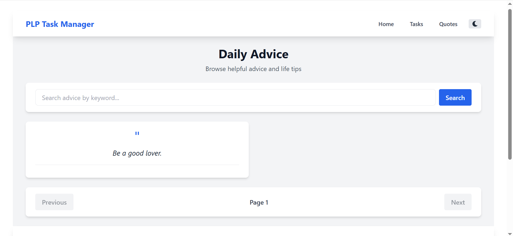

# 🎨 PLP Task Manager - React & Tailwind CSS Project

A modern, responsive task management application built with React, Vite, and Tailwind CSS. This project demonstrates component architecture, state management, hooks usage, API integration, and responsive design principles.

## 🌟 Live Demo

**Deployed URL:** [Add your deployment URL here after deploying]

## 📸 Screenshots

### Home Page

*Modern landing page with feature cards and gradient hero section*

### Task Manager

*Full-featured task management with filtering and local storage persistence*

### Daily Advice

*API integration displaying helpful life advice*

### Dark Mode

*Beautiful dark theme for comfortable viewing*

---

## ✨ Features

### Core Functionality
- ✅ **Task Management System**
  - Create, complete, and delete tasks
  - Filter tasks by status (All, Active, Completed)
  - Persistent storage using localStorage
  - Real-time task counter

- 🌓 **Dark Mode Toggle**
  - Seamless light/dark theme switching
  - Theme persistence across sessions
  - Context API implementation

- 🌐 **API Integration**
  - Fetch data from Advice Slip API
  - Search functionality with keyword filtering
  - Loading and error state management
  - Clean data presentation

- 📱 **Responsive Design**
  - Mobile-first approach
  - Tablet and desktop optimized layouts
  - Smooth transitions and animations
  - Touch-friendly interface

### Technical Features
- ⚡ **Fast Development** with Vite
- 🎨 **Utility-First CSS** with Tailwind CSS
- 🔄 **Client-Side Routing** with React Router
- 🪝 **Custom Hooks** for reusable logic
- 📦 **Component Architecture** for maintainability
- 🎯 **PropTypes** for type checking

---

## 🛠️ Technologies Used

| Technology | Version | Purpose |
|------------|---------|---------|
| **React** | 18.x | UI library for building components |
| **Vite** | 7.x | Build tool and dev server |
| **Tailwind CSS** | 3.4.17 | Utility-first CSS framework |
| **React Router** | 6.x | Client-side routing |
| **PropTypes** | 15.x | Runtime type checking |
| **Advice Slip API** | - | External API for advice content |

---

## 📦 Installation & Setup

### Prerequisites

Before you begin, ensure you have the following installed:
- **Node.js** (v18.0.0 or higher)
- **npm** (comes with Node.js) or **yarn**
- **Git** for version control
- A modern web browser (Chrome, Firefox, Safari, or Edge)

### Step 1: Clone the Repository

```bash
git clone https://github.com/PLP-MERN-Stack-Development/react-js-jsx-and-css-mastering-front-end-development-Goofy-collab.git
cd react-js-jsx-and-css-mastering-front-end-development-Goofy-collab
```

### Step 2: Install Dependencies

```bash
npm install
```

This will install all required packages including:
- React and React DOM
- Vite
- Tailwind CSS and dependencies
- React Router DOM
- PropTypes

### Step 3: Start Development Server

```bash
npm run dev
```

Open your browser and navigate to the URL shown in the terminal.

### Step 4: Build for Production

```bash
npm run build
```

This creates an optimized production build in the `dist/` directory.

### Step 5: Preview Production Build

```bash
npm run preview
```

---

## 🏗️ Project Structure

```
project-root/
├── public/                 # Static assets
├── src/
│   ├── api/               # API integration
│   │   └── api.js         # API calls for advice data
│   ├── components/        # Reusable UI components
│   │   ├── Button.jsx     # Button component with variants
│   │   ├── Card.jsx       # Card container component
│   │   ├── Footer.jsx     # Footer with links
│   │   ├── Layout.jsx     # Main layout wrapper
│   │   ├── Navbar.jsx     # Navigation bar with theme toggle
│   │   └── TaskManager.jsx # Task management component
│   ├── context/           # React Context providers
│   │   └── ThemeContext.jsx # Dark mode context
│   ├── hooks/             # Custom React hooks
│   │   └── useLocalStorage.js # localStorage hook
│   ├── pages/             # Page components
│   │   ├── Home.jsx       # Landing page
│   │   ├── Tasks.jsx      # Task manager page
│   │   └── ApiData.jsx    # API data display page
│   ├── App.jsx            # Main app component with routing
│   ├── main.jsx           # Application entry point
│   └── index.css          # Global styles with Tailwind
├── .gitignore             # Git ignore rules
├── index.html             # HTML template
├── package.json           # Project dependencies
├── postcss.config.js      # PostCSS configuration
├── tailwind.config.js     # Tailwind CSS configuration
├── vite.config.js         # Vite configuration
└── README.md              # This file
```

---

## 🎯 Key Components

### Button Component (`src/components/Button.jsx`)
Reusable button with multiple variants and sizes:
- **Variants:** primary, secondary, danger, success, warning
- **Sizes:** sm, md, lg
- **Props:** variant, size, disabled, onClick, children, className

### Card Component (`src/components/Card.jsx`)
Flexible card container for content:
- **Props:** title, footer, variant, children, className
- **Variants:** default, primary, success, warning, danger

### TaskManager Component (`src/components/TaskManager.jsx`)
Complete task management system:
- Add, complete, and delete tasks
- Filter by All/Active/Completed
- localStorage persistence
- Task counter

### Navbar Component (`src/components/Navbar.jsx`)
Responsive navigation with:
- Mobile hamburger menu
- Dark mode toggle
- Active route highlighting
- React Router integration

### ThemeContext (`src/context/ThemeContext.jsx`)
Global theme management:
- Light/Dark mode switching
- localStorage persistence
- Document class manipulation

---

## 🪝 Custom Hooks

### useLocalStorage (`src/hooks/useLocalStorage.js`)
Custom hook for localStorage state management:
```javascript
const [value, setValue] = useLocalStorage('key', defaultValue);
```
- Syncs state with localStorage
- Handles JSON serialization
- Supports cross-tab synchronization

---

## 🌐 API Integration

### Advice Slip API
- **Base URL:** https://api.adviceslip.com
- **Endpoints Used:**
  - `GET /advice` - Random advice
  - `GET /advice/search/{query}` - Search advice

### Functions (`src/api/api.js`)
- `fetchPosts(page, limit)` - Fetch paginated advice
- `fetchPostById(id)` - Fetch single advice
- `searchPosts(query)` - Search advice by keyword

---

## 🎨 Styling with Tailwind CSS

### Configuration
Tailwind is configured in `tailwind.config.js` with:
- Custom content paths for React files
- Dark mode using `class` strategy
- Extended theme options

### Key Utility Classes Used
- **Layout:** `flex`, `grid`, `container`, `mx-auto`
- **Spacing:** `p-{size}`, `m-{size}`, `gap-{size}`
- **Colors:** `bg-{color}-{shade}`, `text-{color}-{shade}`
- **Dark Mode:** `dark:bg-{color}`, `dark:text-{color}`
- **Responsive:** `sm:`, `md:`, `lg:` prefixes

---

## 📱 Responsive Breakpoints

| Breakpoint | Width | Target Device |
|------------|-------|---------------|
| Default | < 640px | Mobile phones |
| `sm:` | ≥ 640px | Large phones |
| `md:` | ≥ 768px | Tablets |
| `lg:` | ≥ 1024px | Desktop |
| `xl:` | ≥ 1280px | Large desktop |

---

## 🚀 Deployment

### Deploy to Vercel (Recommended)

1. Install Vercel CLI:
```bash
npm install -g vercel
```

2. Login to Vercel:
```bash
vercel login
```

3. Deploy:
```bash
vercel
```

4. Follow the prompts and copy your deployment URL

### Deploy to Netlify

1. Build the project:
```bash
npm run build
```

2. Install Netlify CLI:
```bash
npm install -g netlify-cli
```

3. Login:
```bash
netlify login
```

4. Deploy:
```bash
netlify deploy --prod --dir=dist
```

### Deploy to GitHub Pages

1. Install gh-pages:
```bash
npm install --save-dev gh-pages
```

2. Add to `package.json`:
```json
{
  "homepage": "https://yourusername.github.io/your-repo-name",
  "scripts": {
    "predeploy": "npm run build",
    "deploy": "gh-pages -d dist"
  }
}
```

3. Update `vite.config.js`:
```javascript
export default {
  base: '/your-repo-name/'
}
```

4. Deploy:
```bash
npm run deploy
```

---

## 🧪 Testing the Application

### Manual Testing Checklist

#### Home Page
- [ ] Hero section displays correctly
- [ ] Feature cards are visible
- [ ] Navigation links work
- [ ] Responsive on mobile/tablet/desktop

#### Task Manager
- [ ] Can add new tasks
- [ ] Can mark tasks as complete
- [ ] Can delete tasks
- [ ] Filter buttons work (All/Active/Completed)
- [ ] Task counter updates correctly
- [ ] Tasks persist after page refresh

#### Daily Advice
- [ ] Advice loads on page load
- [ ] Different advice in each card
- [ ] Search functionality works
- [ ] Loading spinner appears during fetch
- [ ] Error message displays on failure
- [ ] Pagination works (if implemented)

#### Dark Mode
- [ ] Theme toggle button works
- [ ] All pages support dark mode
- [ ] Theme persists after refresh
- [ ] Smooth transition between themes

#### Navigation
- [ ] All menu links work
- [ ] Active page is highlighted
- [ ] Mobile menu opens/closes
- [ ] Logo links to home

---

## 📚 Learning Resources

- [React Documentation](https://react.dev/)
- [Tailwind CSS Documentation](https://tailwindcss.com/docs)
- [Vite Documentation](https://vitejs.dev/)
- [React Router Documentation](https://reactrouter.com/)
- [MDN Web Docs](https://developer.mozilla.org/)

---

## 📄 License

This project is open source and available under the [MIT License](LICENSE).

---

## 🙏 Acknowledgments

- **Power Learn Project** for the comprehensive curriculum and assignment structure
- **Advice Slip API** for providing free, helpful advice content
- **Tailwind CSS Team** for the amazing utility-first CSS framework
- **React Team** for the powerful UI library
- **Vite Team** for the blazingly fast build tool

---


**Built with ❤️ as part of the Power Learn Project curriculum**